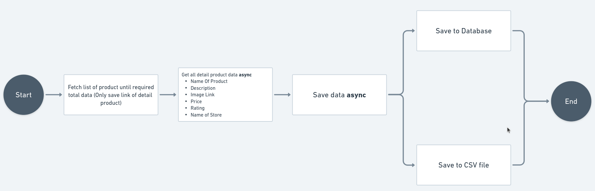

# Product Scrapper
This program created to fulfill the Technical test in Brick. This program used to getting top data products from Tokopedia platform (only Mobile Phone/Handphone category). This program use Web Scrapping methodology to getting the data from Tokopedia web page.

Here is the definition of web scrapping you can refer to this link [https://www.geeksforgeeks.org/what-is-web-scraping-and-how-to-use-it/](https://www.geeksforgeeks.org/what-is-web-scraping-and-how-to-use-it/)
> Web scraping is an automatic method to obtain large amounts of data from websites. Most of this data is unstructured data in an HTML format which is then converted into structured data.

## Feature Requirement

### Functional Requirement
- Scrapping Top 100 product data from Tokopedia's web page. (On 1 page there is 75 products, so it should be only scrapping until page 2)
- Program should be satisfy to get data until web page fully loaded. So program need to make sure all the HTML data fully loaded to get real data from web page as expectation.
- Program need to store following information in CSV, and Postgresql Database
	- Name of Product
	- Description
	- Image Link
	- Price
	- Rating (out of 5 stars)
	- Name of Store or Merchant
- Program need to implement with design philosophy
- Program should implement multithread process with minimum 5 multithreading.

### Additional Requirement
- With doing multithread, program still need to concerning about Memmory usage, Performance, etc without removing any expectation.

## Demo
You can check out to this link for demo [https://drive.google.com/file/d/13ZiJ1EsBvZIb--txuva7tF4cfNkioWXy/view?usp=sharing](https://drive.google.com/file/d/13ZiJ1EsBvZIb--txuva7tF4cfNkioWXy/view?usp=sharing)

## System Design



## Libraries

This project using this following library to achieve all the requirements :

- Cobra
- Viper
- Chromedp
- Squirrel

> Chromedp is very weight library, we use it because we need to satisfy Web Scrapping requirement

## Installation Requirement

This program using Chromedp to do scrapping the data from website. You need to install all required Chromedp in here [https://github.com/chromedp/chromedp](https://github.com/chromedp/chromedp)

Don't forget to change `.env.example` file to `.env` and then use your DB configuration
```
DB_HOST=127.0.0.1
DB_PORT=5432
DB_USER=root
DB_PASS=password
DB_NAME=root
```
## DB Migration
To migrate UP database table, you can use this command

```bash
go run main.go migrate up
```

To migrate DOWN database table, you can use this command

```bash
go run main.go migrate up
```

> Make sure you already set .env file to run this command.

## Scrapping Process
You can only use this command to do scrapping data from Tokopedia page
```bash
go run main.go scrap
```

If you want to check more detail about the scrap command you just run --help
```bash
go run main.go scrap --help
```
## Deep Dive into Code

### Multithread process
This code using multithread but we also need to handle how many concurrency that will running at the same time. If we don't handle that, it will make PC running slowly even crashing because `Chromedp` is weight enough . Cause of that is this program using `Chromedp` that the tools using `Google Chrome Browser` to act like a real borwser to scrap all the data that required. If we don't limit the thread, it will consume more Memmory.

> <b>Trade off</b> : Using multithread limitter process is better than we're not satisfy required requirement (Using web scrapping, interact with HTML data).

```go
var  defaultMaxThread  =  10

func (u *ScrappingUsecase) getDataProducts(productLinks []entity.ProductLink) (products []entity.Product) {
	var (
		wg sync.WaitGroup
		// Use to handle maximum thread
		ch  =  make(chan  bool, u.maxThread)
	)

	defer  close(ch)

	products  =  make([]entity.Product, 0)

	for  i, productLink  :=  range productLinks {
		wg.Add(1)
		ch <-  true

		go  func(idx int, productLink entity.ProductLink) {
			log.Println(idx, "Fetching", productLink.ExtractLink())
			defer wg.Done()

			product, err  := u.ds.GetProductDetail(productLink)
			if err !=  nil {
				log.Fatal(err)
			}

			products  =  append(products, product)
			<-ch
		}(i, productLink)
	}

	wg.Wait()

	return
}
```

### Chain of Responsibility Design Pattern

There is process that good to use Chain of Responsibility pattern. Here is the code:

```go
package dwritter

import (
	"errors"
	"log"
	"sync"

	"github.com/freekup/coba-coba/app/entity"
)

type DataWritter struct {
	handlers map[string]DWHandlerInterface
}

func NewDataWritter() DataWritter {
	return DataWritter{
		handlers: make(map[string]DWHandlerInterface),
	}
}

func (dw *DataWritter) RegisterWritter(name string, handler DWHandlerInterface) error {
	if _, ok := dw.handlers[name]; ok {
		return errors.New("handler already registered")
	}

	dw.handlers[name] = handler
	return nil
}

func (dw *DataWritter) Write(loc []string, products []entity.Product) error {
	var wg sync.WaitGroup

	for _, l := range loc {
		if _, isExist := dw.handlers[l]; !isExist {
			log.Fatal("type", l, "is not supported")
		}

		wg.Add(1)

		go func(action string) {
			defer wg.Done()

			err := dw.handlers[action].Store(products)
			if err != nil {
				log.Fatal(err)
			}
		}(l)
	}

	wg.Wait()
	return nil
}

```

On that code we're using Chain of Responsibility pattern because that is different detail process but same request data. So better we use this design pattern to achive cleaner code, and not making all of code to single function.

### Single Responsibility Principle
One of the SOLID principle is Single Responsibility. In this code we implement this principle to make sure all of the function only doing their responsibility, the result is there is no function that have bunch lines of code.

### Open-Closed Principle
> Software entities should be open for extension, but closed for modification. - Bertrand Meyer

One of the SOLID principle is Open-Closed.  In this code we implement this principle in Data Writter tool `dwritter` package. So, it related with Chain of Responsibility Pattern. If want to add another writter handle, we just create the handle and don't make any mess on another handler.

### Interface Segregation Principle
One of the SOLID principle is Interface Segragation. In this code we implement this principle in Data Writter tool `dwritter` package. So, it related with Chain of Responsibility Pattern.